# 🚀 CodeExam – Smart Coding Exam System

<p align="center">


</p>

---

## 🌐 Live Preview

[](http://13.60.52.103)


## 📖 About The Project

**CodeExam** is a Smart Coding Exam System designed to provide a complete online platform for conducting programming examinations.

The system provides separate interfaces for **Administrators** and **Students**.

Administrators can create and manage exams, add programming questions manually, generate questions using AI, upload files for AI-based question generation, manage students, and monitor examination activities.

Students can register, log in, participate in timed coding exams, write and execute code using an online code editor, submit solutions, view results, and check the global leaderboard.

The application is built using a modern **React + TypeScript frontend** and a secure **Spring Boot backend** with **MySQL** database support.

---

## ✨ Main Highlights

✔️ Admin & Student Roles  
✔️ Secure Authentication  
✔️ JWT Based Authorization  
✔️ Admin Dashboard  
✔️ Student Dashboard  
✔️ Exam Creation & Management  
✔️ Manual Question Creation  
✔️ AI Question Generation  
✔️ Multiple AI Question Generation  
✔️ AI File Upload Question Generation  
✔️ PDF / DOC / DOCX / TXT / MD Support  
✔️ Online Coding Exam  
✔️ Monaco Code Editor  
✔️ Live Exam Timer  
✔️ Code Execution  
✔️ Test Case Support  
✔️ Automatic Evaluation  
✔️ Exam Submission  
✔️ Result Management  
✔️ Global Leaderboard  
✔️ Student Management  
✔️ Docker Support  
✔️ AWS EC2 Deployment  

---

# 📸 Screenshots

## 🏠 Landing Page

<table width="100%">
<tr>
<td align="center">

<b>CodeExam Landing Page</b>

</td>
</tr>

<tr>
<td align="center">

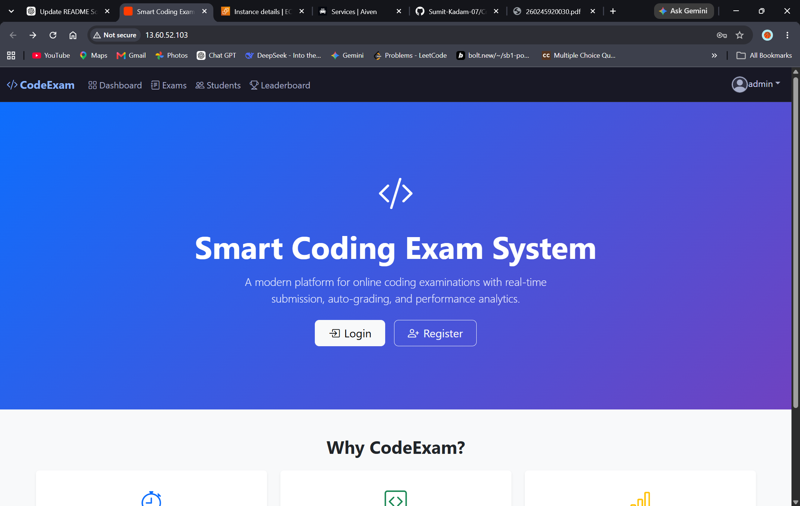

</td>
</tr>
</table>

---

## 🔐 Login & Registration

<table width="100%">
<tr>

<td align="center">
<b>Login</b>
</td>

<td align="center">
<b>Registration</b>
</td>

</tr>

<tr>

<td align="center">

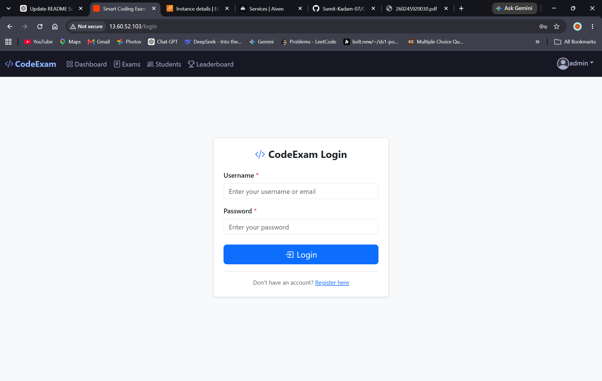

</td>

<td align="center">

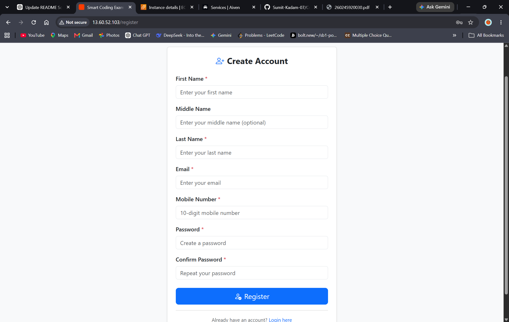

</td>

</tr>
</table>

---

## 👨‍💼 Admin Dashboard

<table width="100%">
<tr>
<td align="center">

<b>Admin Dashboard</b>

</td>
</tr>

<tr>
<td align="center">

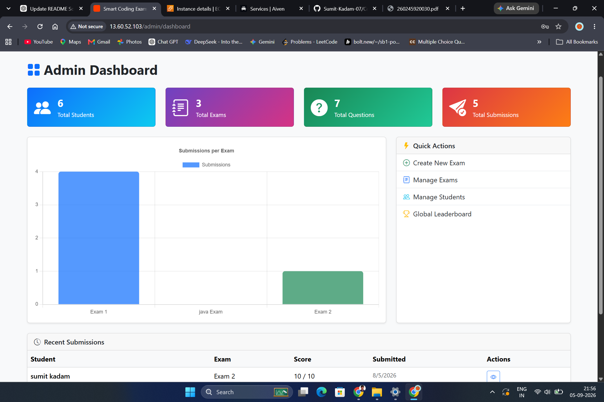

</td>
</tr>
</table>

---

## 📝 Create & Manage Exams

<table width="100%">
<tr>

<td align="center">
<b>Create New Exam</b>
</td>

<td align="center">
<b>Manage Exams</b>
</td>

</tr>

<tr>

<td align="center">

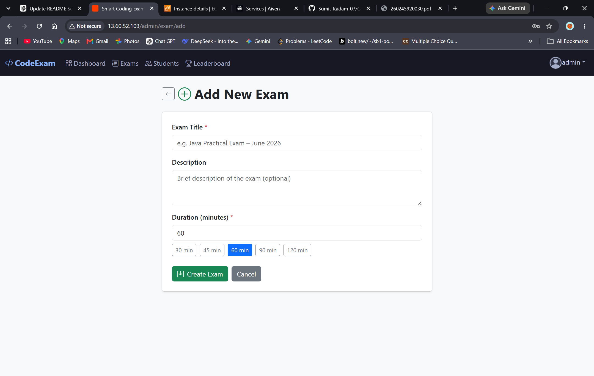

</td>

<td align="center">

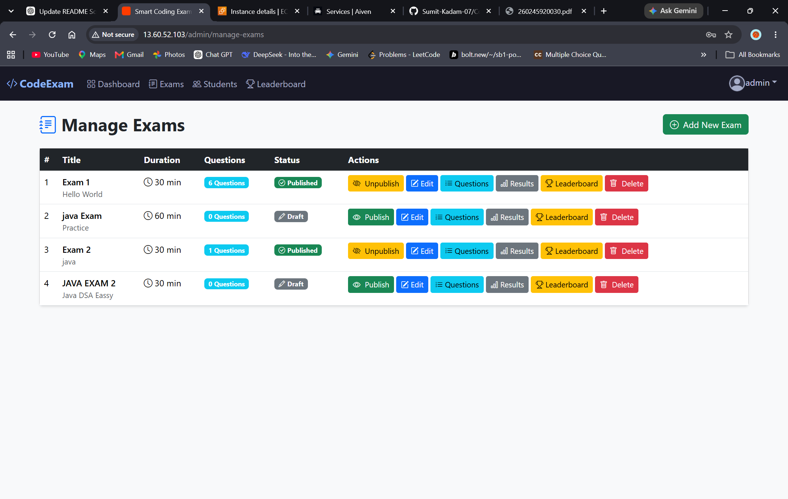

</td>

</tr>
</table>

---

## 🤖 AI Question Generator

<table width="100%">
<tr>
<td align="center">

<b>AI Question Generator</b>

</td>
</tr>

<tr>
<td align="center">

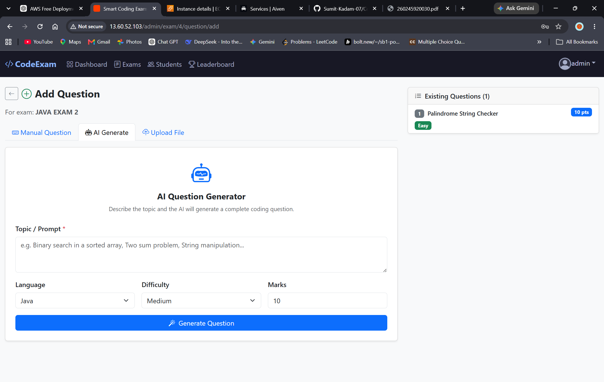

</td>
</tr>
</table>

---

## ✍️ Manual Question Creation

<table width="100%">
<tr>
<td align="center">

<b>Manual Add Question</b>

</td>
</tr>

<tr>
<td align="center">

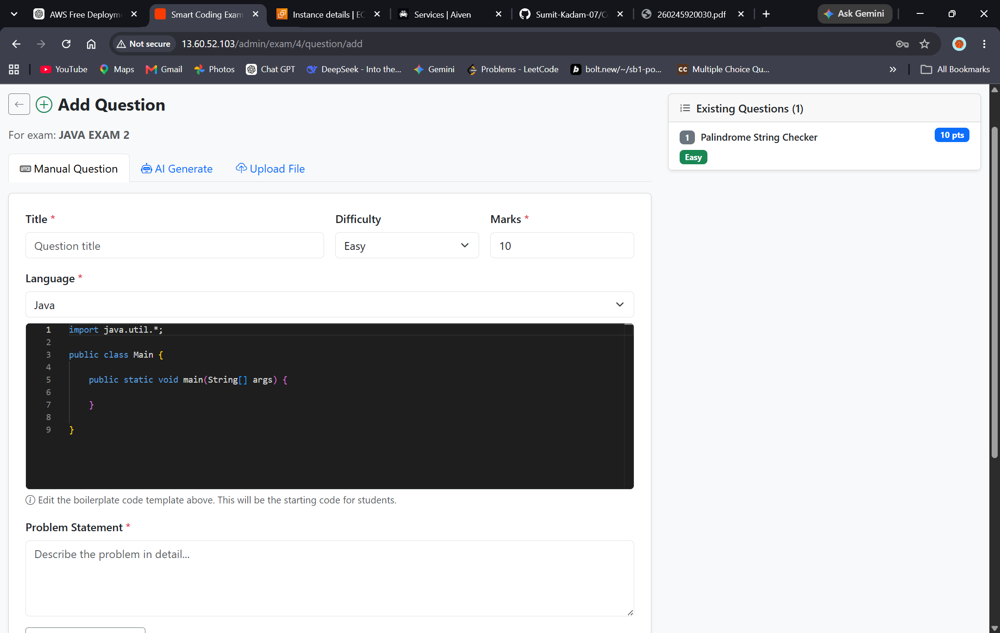

</td>
</tr>
</table>

---

## 📂 Upload Question File

<table width="100%">
<tr>
<td align="center">

<b>Upload Question File</b>

</td>
</tr>

<tr>
<td align="center">

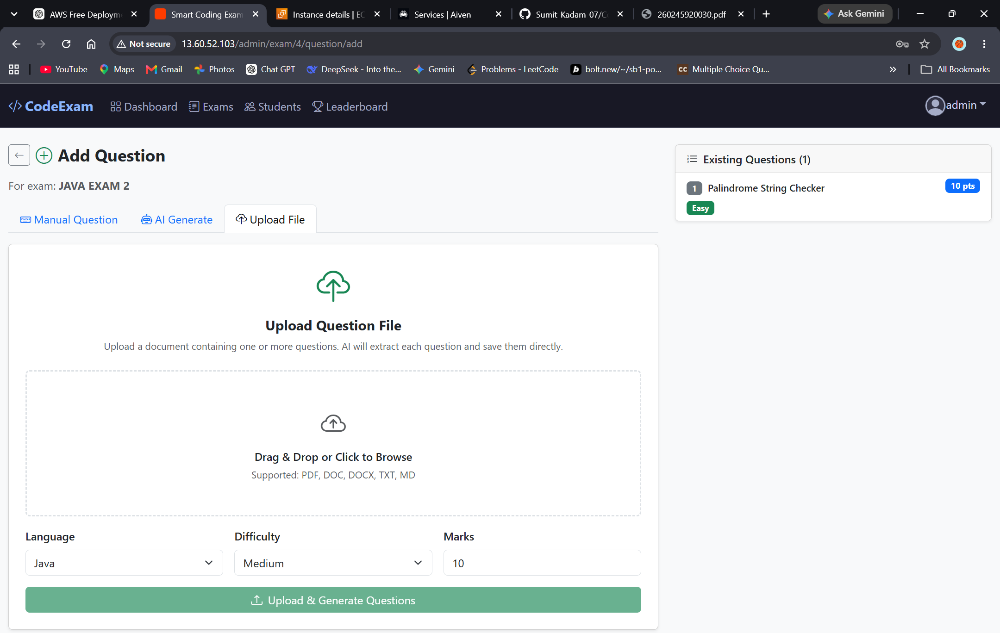

</td>
</tr>
</table>

---

## 📚 Manage Questions

<table width="100%">
<tr>
<td align="center">

<b>Manage Questions</b>

</td>
</tr>

<tr>
<td align="center">

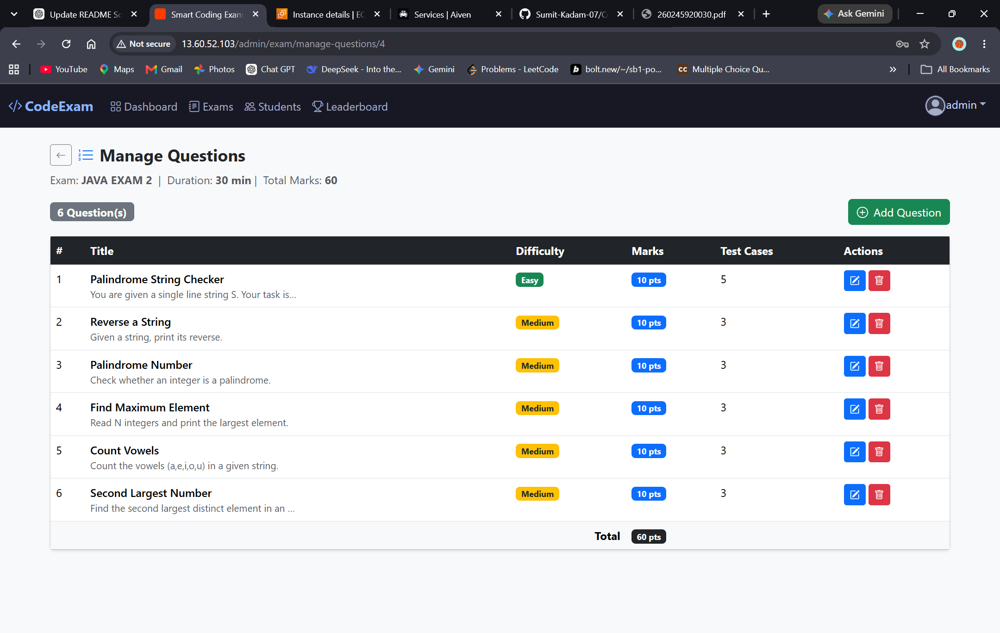

</td>
</tr>
</table>

---

## 👨‍🎓 Manage Students

<table width="100%">
<tr>
<td align="center">

<b>Manage Students</b>

</td>
</tr>

<tr>
<td align="center">

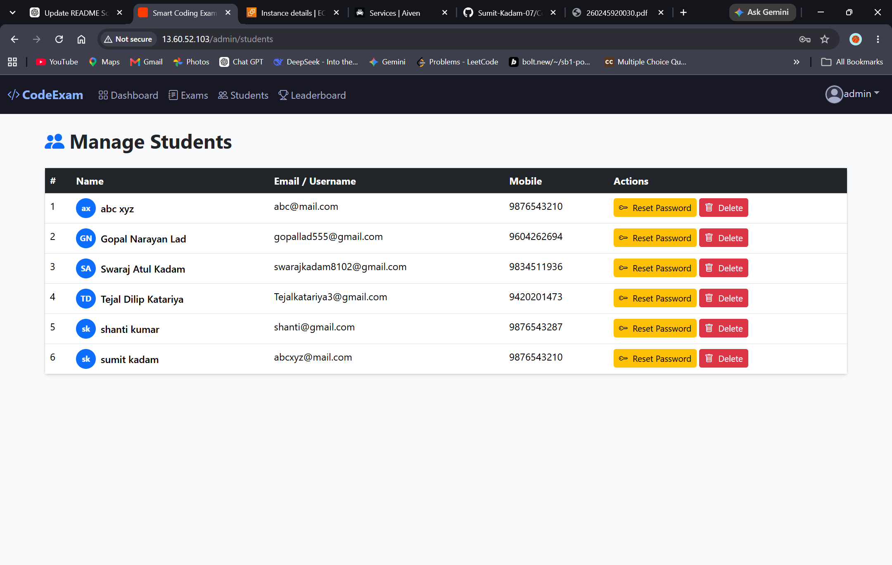

</td>
</tr>
</table>

---

## 🏆 Global Leaderboard

<table width="100%">
<tr>
<td align="center">

<b>Global Leaderboard</b>

</td>
</tr>

<tr>
<td align="center">

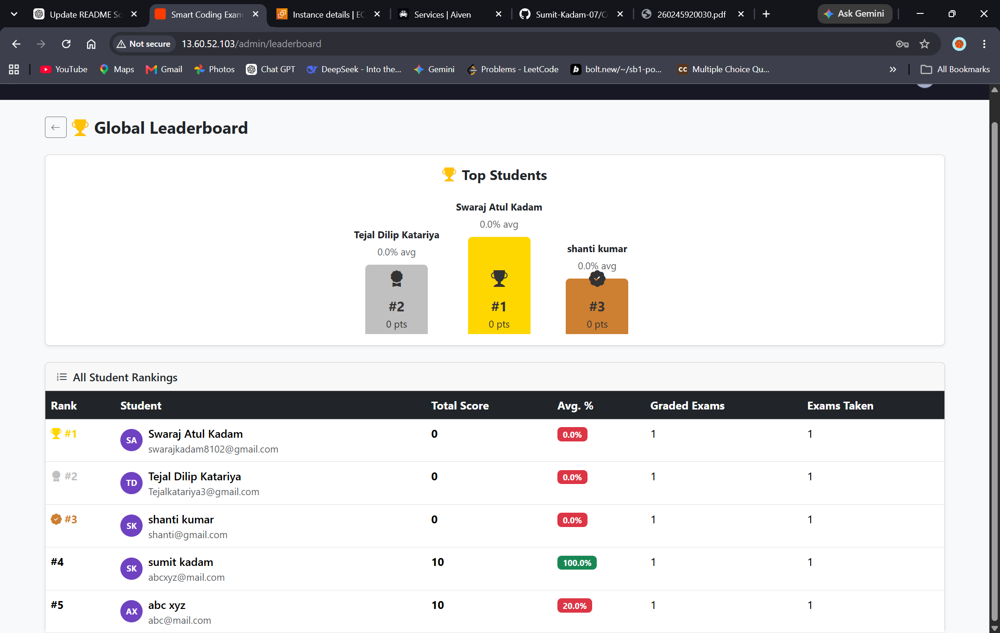

</td>
</tr>
</table>

---

## 👨‍🎓 Student Dashboard

<table width="100%">
<tr>
<td align="center">

<b>Student Dashboard</b>

</td>
</tr>

<tr>
<td align="center">

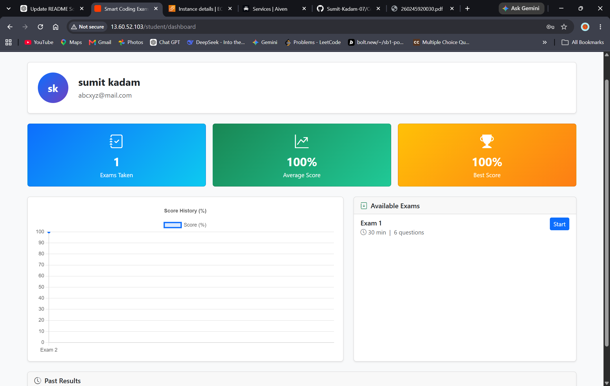

</td>
</tr>
</table>

---

## 💻 Online Coding Exam

<table width="100%">
<tr>
<td align="center">

<b>Coding Exam Interface</b>

</td>
</tr>

<tr>
<td align="center">

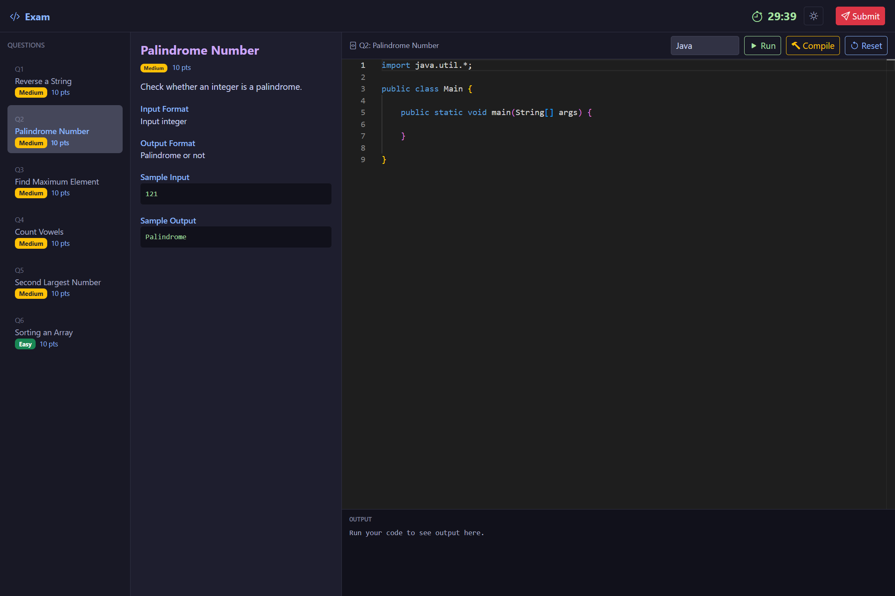

</td>
</tr>
</table>

---

## ✅ Exam Submitted

<table width="100%">
<tr>
<td align="center">

<b>Exam Submitted Successfully</b>

</td>
</tr>

<tr>
<td align="center">

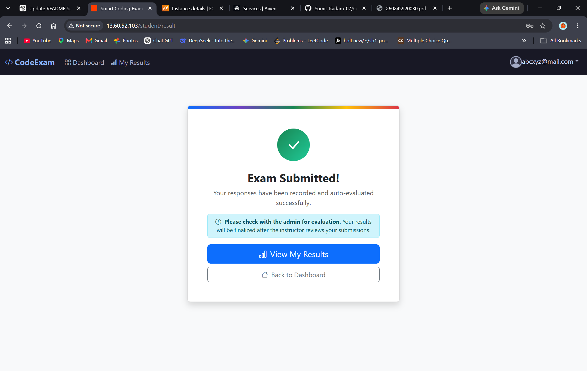

</td>
</tr>
</table>

---

# 👨‍💼 Admin Features

The Admin module provides complete control over the examination system.

### 🔐 Authentication

- Secure Admin Login
- JWT Based Authentication
- Role Based Authorization

### 📊 Dashboard

- Total Exams
- Total Students
- Total Questions
- Exam Statistics
- Quick Management Actions

### 📝 Exam Management

- Create Exam
- Edit Exam
- Delete Exam
- Publish Exam
- Unpublish Exam
- Configure Exam Duration
- Configure Total Marks

### 📚 Question Management

- Add Questions Manually
- Edit Questions
- Delete Questions
- View Questions
- Manage Test Cases
- Assign Questions to Exams

### 🤖 AI Question Generation

- Generate Questions using AI
- Generate Multiple Questions
- Select Programming Language
- Select Difficulty
- Configure Marks
- Generate Questions from Topic
- Generate Questions from Uploaded Files

### 👨‍🎓 Student Management

- View Students
- Manage Students
- Monitor Student Participation
- View Student Performance

### 🏆 Results & Leaderboard

- View Exam Results
- Monitor Student Scores
- Global Leaderboard

---

# 👨‍🎓 Student Features

The Student module provides a complete online coding examination experience.

### 🔐 Authentication

- Student Registration
- Student Login
- Secure Authentication

### 📊 Student Dashboard

- View Available Exams
- View Completed Exams
- View Results
- View Performance
- View Leaderboard

### 💻 Coding Exam

- Start Exam
- Live Exam Timer
- Problem Statement
- Monaco Code Editor
- Write Code
- Run Code
- Compile Code
- Reset Code
- Execute Test Cases
- Navigate Between Questions
- Question Palette
- Submit Answers

### 📊 Results

- Exam Submission
- Score Calculation
- Result Display
- Performance Tracking
- Leaderboard Ranking

---

# 🤖 AI Question Generator

CodeExam includes an AI-powered question generation module that helps administrators create programming questions automatically.

## Generate Questions From Topic

The administrator can provide:

```text
Topic:
Java Arrays

Programming Language:
Java

Difficulty:
Medium

Marks:
10

Number of Questions:
5
```

# Generate 10 Java programming questions.

Difficulty: Medium
Marks: 10

Each question should contain:

- Problem Statement
- Input
- Output
- Constraints
- Sample Input
- Sample Output
- Test Cases

# AI Question Processing

```text
AI Request
    ↓
Generate Questions
    ↓
Receive Response
    ↓
Parse JSON
    ↓
Validate Data
    ↓
Create Questions
    ↓
Save to Database
    ↓
Add to Selected Exam
```
---

# 📂 AI File Upload Question Generation

Administrators can upload programming-related documents and generate questions automatically.

### Supported File Formats

```text
PDF
DOC
DOCX
TXT
MD
```
# Process 
```text
AI Request
    ↓
Generate Questions
    ↓
Receive Response
    ↓
Parse JSON
    ↓
Validate Data
    ↓
Create Questions
    ↓
Save to Database
    ↓
Add to Selected Exam
```
# 📝 Question Management

CodeExam provides administrators with complete control over the questions used in coding examinations.

## Add Questions Manually

Administrators can create programming questions manually by providing:

```text
Question Title
Question Description
Programming Language
Difficulty Level
Marks
Input Format
Output Format
Sample Input
Sample Output
Test Cases
```
# 👨‍🎓 Student Management

CodeExam provides administrators with a dedicated student management module to manage registered students and monitor their participation in examinations.

## Manage Students

Administrators can:

- View all registered students
- View student details
- Monitor student participation
- Manage student accounts
- Track examination activity

### Student Management Interface


# 🏆 Leaderboard & Results

CodeExam provides a leaderboard and result system to evaluate student performance in coding examinations.

## Global Leaderboard

The global leaderboard displays student rankings based on their examination performance.

Students can compare their scores and rankings with other participants.


## Exam Results

After submitting an examination, students can view their result and performance details.

The result system provides information such as:

- Total marks
- Obtained marks
- Questions attempted
- Correct answers
- Incorrect answers
- Final score
- Performance summary


# 💻 Student Dashboard & Coding Exam

Students get a dedicated dashboard where they can access available examinations and participate in coding assessments.

## Student Dashboard

The student dashboard provides access to:

- Available examinations
- Upcoming examinations
- Completed examinations
- Examination results
- Leaderboard
- Performance information


## Coding Exam Interface

The coding exam interface provides an interactive environment where students can solve programming questions.

Students can:

- Read the programming problem
- Write code directly in the browser
- Select the required programming language
- Execute and test their solution
- Submit their answer
- Navigate between questions
- Track the examination timer

CodeExam uses the **Monaco Editor** to provide a modern code-editing experience.


## Exam Submission

After completing the examination, students can submit their answers and view the submission status.


# 🛠️ Tech Stack

CodeExam is built using modern web technologies with a React-based frontend and Spring Boot backend.

## Frontend

- **React 19**
- **TypeScript**
- **Vite**
- **React Router / Wouter**
- **Axios**
- **Monaco Editor**
- **Chart.js**
- **HTML5**
- **CSS3**

## Backend

- **Java 17**
- **Spring Boot 3.2**
- **Spring Web**
- **Spring Data JPA**
- **Spring Security**
- **JWT Authentication**
- **Hibernate**

## Database

- **MySQL**
- **H2 Database** for development/testing

## Additional Technologies

- **Maven** – Backend dependency management
- **npm** – Frontend package management
- **Docker** – Containerization
- **Apache PDFBox** – PDF processing
- **Apache POI** – Document processing
- **Gson** – JSON processing
- **Git & GitHub** – Version control

# 📁 Project Structure

```text
CodeExam/
│
├── backend/
│   ├── src/
│   │   ├── main/
│   │   │   ├── java/
│   │   │   │   └── ...
│   │   │   └── resources/
│   │   └── test/
│   ├── pom.xml
│   └── ...
│
├── frontend/
│   └── frontend/
│       ├── src/
│       │   ├── components/
│       │   ├── pages/
│       │   ├── services/
│       │   ├── types/
│       │   └── ...
│       ├── package.json
│       ├── vite.config.ts
│       └── ...
│
├── database/
│   └── ...
│
├── Documents/
│   └── screenshots/
│       ├── 01-home.png
│       ├── 02-login.png
│       ├── 03-register.png
│       ├── 04-admin-dashboard.png
│       └── ...
│
├── docker-compose.yml
├── start-system.bat
├── README.md
└── TODO.md
```

# 🚀 How to Run the Project

Follow the steps below to run CodeExam locally.

## 1. Clone the Repository

```bash
git clone https://github.com/Sumit-Kadam-07/CodeExam.git
cd CodeExam
```

## 2. Configure the Database

Make sure MySQL is installed and running.

Create a database for the project:

```bash
CREATE DATABASE codeexam;
```

Update the database configuration in the Spring Boot application with your MySQL username, password, and database name.

Example:

```bash
spring.datasource.url=jdbc:mysql://localhost:3306/codeexam
spring.datasource.username=root
spring.datasource.password=YOUR_PASSWORD
```

## 3. Run the Backend

Navigate to the backend directory:

```bash
cd backend
```

Run the Spring Boot application using Maven:

```bash
mvn spring-boot:run
```

The backend will start and provide the REST APIs required by the frontend.

## 4. Run the Frontend

Open another terminal and navigate to the frontend directory:

```bash
cd frontend/frontend
```

Install the required dependencies:

```bash
npm install
```

Start the Vite development server:

```bash
npm run dev
```

Open the URL displayed by Vite in your browser.

## 5. Using Docker

CodeExam also includes Docker configuration for running the application using containers.

From the project root directory:

```bash
docker-compose up --build
```

To run the containers in the background:

```bash
docker-compose up -d --build
```

Check running containers using:

```bash
docker ps
```

To stop the application:

```bash
docker-compose down
```

## 6. Build the Frontend

To create a production build:

```bash
cd frontend/frontend
npm run build
```

The production files will be generated in the dist directory.

## 7. Build the Backend

From the backend directory:

```bash
mvn clean package

```
The generated JAR file will be available inside:

```bash
backend/target/
```

## 8. Access the Application

Once the frontend and backend are running, open the frontend URL in your browser.

You can then:

Register as a student.
Login to the application.
Browse available examinations.
Attempt coding questions.
Submit the examination.
View results and leaderboard rankings.

Administrators can login to the admin dashboard to create examinations, manage questions, manage students, and generate questions using AI.

# 🔐 Authentication & Security

CodeExam includes a secure authentication and authorization system to protect user accounts and application resources.

## User Authentication

Users can register and login to the application using their credentials.

The system provides:

- User registration
- User login
- Secure password handling
- JWT-based authentication
- Authenticated API requests
- Logout functionality

## Role-Based Authorization

CodeExam supports different user roles with access to role-specific features.

### 👨‍💼 Admin

Administrators can:

- Create and manage examinations
- Add and manage questions
- Generate questions using AI
- Upload files for question generation
- Manage students
- View examination data
- Monitor results and leaderboard

### 👨‍🎓 Student

Students can:

- Access available examinations
- Attempt coding questions
- Submit solutions
- View examination results
- View leaderboard rankings

## JWT Authentication

The backend uses **JSON Web Tokens (JWT)** for authentication.

After successful login, the authenticated user receives a token that is used to authorize protected API requests.

```text
User Login
    ↓
Authentication
    ↓
JWT Token
    ↓
Authenticated Requests
    ↓
Role-Based Authorization
    ↓
Protected Resources
```

# 🐳 Docker Deployment

CodeExam can be deployed using Docker to simplify application setup and deployment.

The project includes a `docker-compose.yml` file that can be used to run the application services together.

## Docker Compose

From the project root directory, run:

```bash
docker-compose up --build
```
To run the application in detached mode:

```bash
docker-compose up -d --build
```
Check Running Containers

Use the following command to verify that the containers are running:

```bash
docker ps
```
View Container Logs

To view application logs:

```bash
docker-compose logs
```

To follow logs continuously:

```bash
docker-compose logs -f
```
Stop the Application

To stop and remove the running containers:

```bash
docker-compose down
```
Rebuild Containers

If changes are made to the application, rebuild the Docker images using:

```bash
docker-compose up -d --build
```
Docker Architecture
```text
                ┌─────────────────────┐
                │       Browser       │
                └──────────┬──────────┘
                           │
                           ▼
                ┌─────────────────────┐
                │ Frontend Container  │
                │   React + Vite      │
                └──────────┬──────────┘
                           │
                           ▼
                ┌─────────────────────┐
                │ Backend Container   │
                │ Spring Boot + Java  │
                └──────────┬──────────┘
                           │
                           ▼
                ┌─────────────────────┐
                │ Database Container  │
                │       MySQL         │
                └─────────────────────┘
```
## 18. ⚙️ Configuration

Before running CodeExam, configure the database and application settings.

### Database Configuration

CodeExam uses MySQL as the primary database.

Create the database:

```sql
CREATE DATABASE codeexam;
```

Configure the database connection in the Spring Boot `application.properties` file:

```properties
spring.datasource.url=jdbc:mysql://localhost:3306/codeexam
spring.datasource.username=root
spring.datasource.password=YOUR_PASSWORD

spring.jpa.hibernate.ddl-auto=update
spring.jpa.show-sql=false
spring.jpa.properties.hibernate.dialect=org.hibernate.dialect.MySQLDialect
```

Replace `YOUR_PASSWORD` with your MySQL password.

### JWT Configuration

The application uses JWT for authentication and authorization.

Configure the JWT secret in the backend configuration:

```properties
jwt.secret=YOUR_SECRET_KEY
```

Use a strong secret key for production deployments.

### Frontend API Configuration

The React frontend communicates with the Spring Boot backend through REST APIs.

Configure the backend API URL according to your environment:

```env
VITE_API_URL=http://localhost:8080
```

For production deployment, replace it with the URL of the deployed backend:

```env
VITE_API_URL=https://your-backend-domain.com
```

### Environment Variables

Sensitive information should not be hard-coded in the source code.

Example:

```env
DB_USERNAME=root
DB_PASSWORD=YOUR_PASSWORD
JWT_SECRET=YOUR_SECRET_KEY
VITE_API_URL=http://localhost:8080
```

> **Important:** Never commit passwords, API keys, JWT secrets, or other sensitive credentials to GitHub.

### Configuration Checklist

Before starting the application, make sure:

```text
✓ MySQL is installed and running
✓ codeexam database is created
✓ Database username and password are configured
✓ JWT secret is configured
✓ Backend API URL is configured
✓ Required environment variables are available
✓ Frontend and backend dependencies are installed
```

## 19. 🧪 Testing

CodeExam can be tested at both the backend and frontend levels to verify that the application works correctly.

### Backend Testing

Navigate to the backend directory:

```bash
cd backend
```

Run the Spring Boot tests using Maven:

```bash
mvn test
```

To build the backend and run the available tests:

```bash
mvn clean test
```

### Frontend Testing

Navigate to the frontend directory:

```bash
cd frontend/frontend
```

Install dependencies if required:

```bash
npm install
```

Build the frontend application:

```bash
npm run build
```

The build command verifies that the React and TypeScript source code can be compiled successfully.

### Manual Testing

The following major modules can be tested manually:

```text
Authentication
    ↓
Registration & Login
    ↓
Admin Dashboard
    ↓
Create Examination
    ↓
Add / Generate Questions
    ↓
Manage Students
    ↓
Student Dashboard
    ↓
Attempt Coding Exam
    ↓
Submit Examination
    ↓
View Results
    ↓
Leaderboard
```

### Functional Testing Checklist

```text
✓ User registration
✓ User login
✓ JWT authentication
✓ Admin dashboard
✓ Create examination
✓ Edit and manage examinations
✓ Add questions manually
✓ Generate questions using AI
✓ Upload files for AI question generation
✓ Manage questions
✓ Manage students
✓ Student dashboard
✓ Coding exam
✓ Code execution and submission
✓ Exam timer
✓ Exam submission
✓ Result calculation
✓ Leaderboard
```

### Production Build Verification

Before deployment, verify that both applications build successfully:

```bash
# Backend
cd backend
mvn clean package
```

```bash
# Frontend
cd frontend/frontend
npm run build
```

A successful build indicates that the application is ready for deployment.

## 20. 📌 Future Enhancements

The CodeExam platform can be further enhanced with additional features and improvements.

### Planned Improvements

- 🤖 Advanced AI-based question generation
- 📊 Detailed student performance analytics
- 📈 Admin analytics dashboard
- 🔔 Email and notification system
- 🏅 Advanced ranking and achievement system
- 📚 Question bank with category and topic filtering
- 🔄 Randomized questions for each examination
- 🌐 Support for additional programming languages
- ☁️ Cloud-based deployment and scalability improvements
- 📱 Improved responsive design for mobile devices
- 🔒 Additional security and authentication improvements
- ⚡ Performance optimization for large-scale examinations

### Long-Term Goals

```text
AI-Powered Question Generation
            ↓
Large Question Bank
            ↓
Automated Examination Creation
            ↓
Online Coding Assessment
            ↓
Automated Evaluation
            ↓
Performance Analytics
            ↓
Personalized Learning Insights
```

The goal is to evolve CodeExam into a complete and scalable platform for conducting programming and technical assessments.

## 21. 📄 License

This project is developed for educational and demonstration purposes.

The source code is available on GitHub for learning, development, and reference.

### 👨‍💻 Developer

**Sumit Kadam**

GitHub Repository: https://github.com/Sumit-Kadam-07/CodeExam

---

⭐ If you find this project useful, consider giving the repository a star!
